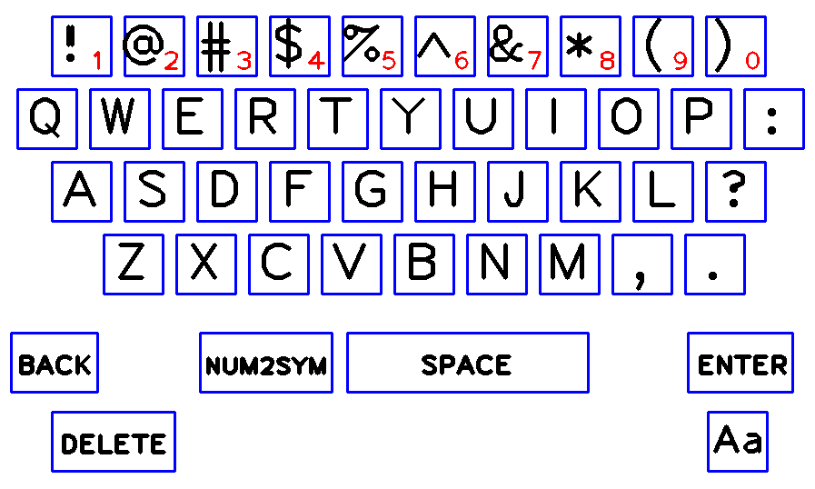

# Virtual on screen keyboard
Virtual Keyboard with color tracking using Python and OpenCV library.

## Main Idea
The main idea of this project is to display the keys of a keyboard on the screen and allow the user to select (type) a character when the desired color (or finger) is inside the rectangle which corresponding to a key.

## Settings for drawing the on-screen keyboard
### [1] Rectangle and Text settings
```python
width, height = 65, 65
dist = 15 # Distance between two consecutive rectangles

# Initial position of text in frame
start_x = int((video.shape[1] - (10*width + 9*dist))/2)
start_y = 50

# Text settings
font = cv2.FONT_HERSHEY_PLAIN  # Font
fontThickness = 4              # Font weight
fontScale = 4                  # Font scale
```
### [2] Strings containing the necessary characters
Define strings containing the necessary characters like numbers, letters, symbols and commands.
```python
# Set a string with letters, numbers and symbols
numbers = "1234567890" # String containing 10 numbers (0-9)
alphabet = "1234567890QWERTYUIOP:ASDFGHJKL?ZXCVBNM,.<->[_]"

# Strings used in basic-'command' buttons
symbol_strings = ["BACK", "DELETE", "ENTER", "Aa", "SPACE", "NUM2SYM"] 
```
Explanation of the 6 final alphabet symbols
| Symbol | Explanation |
|   ---  |     ---     |
|    <   | Delete one character (BACK) |
|    -   | Delete all (DELETE) |
|    >   | Newline character (ENTER) |
|    [   | Change between capitals/lowercase (Aa) |
|    _   | Leave one character empty (SPACE) |
|    ]   | Change between numbers/symbols (NUM2SYM) |

For the drawing of the characters (numbers,letters and commands) see the functions *[draw_letters](https://github.com/kostasthanos/Virtual-on-screen-keyboard/blob/main/vkct.py)* and *[draw_extra_chars](https://github.com/kostasthanos/Virtual-on-screen-keyboard/blob/main/vkct.py)*.

<p align="center">
  
</p>

## Extra black window containing the selected characters (output message)
```python
paper = np.zeros((250,1000,3), np.uint8)
cv2.namedWindow("Paper")
# Starting position of text in "Paper" frame
start_write_x = 5
start_write_y = 35
```
In this window someone can see the following :
1. Selected characters - text 'typed' so far
2. Active writting line
3. Upper/Lower case option (green color for the selected one)
4. Press 'p' or 'P' to print and save the message to a txt file
### txt file name
Every time someone is pressing 'p' or 'P' the message is being saved on a txt file with name in format :
```
messagenum_DD-MM-YY_HH:MM -      num : Number of message in file
                          - DD-MM-YY : Current date (day-month-year)
                          -    HH:MM : Current time (hour:minutes)
e.g. message1_26-07-20_21:30.txt
```
Check *[messages](https://github.com/kostasthanos/Virtual-on-screen-keyboard/tree/main/messages)* file to see some examples.

<p align="center">
  
</p>

## Color settings and color-tracking
Define the lower and upper color for the color-tracking part
```python
lower_color = np.array([75, 169, 45], np.uint8)
upper_color = np.array([96, 255, 255], np.uint8)
```
Alternative someone can use trackbars window. See *[Hand Gestures](https://github.com/kostasthanos/Hand-Gestures-and-Finger-Counting)* for more details.

## Print-write selected character
First of all find the max contour in the frame. Find the center of the max contour and check if center is inside a letter box per row of rectangles in frame.
```python
contour = max(contours, key=cv2.contourArea) # Find the maximum contour each time (on each frame)  
M = cv2.moments(contour)

# Draw each contour
cv2.drawContours(frame, [contour], -1, (0,255,0), 2)
# Find each contour center
if int(M["m00"])!=0:
    cx = int(M["m10"] / M["m00"])
    cy = int(M["m01"] / M["m00"])
    cv2.circle(frame, (cx, cy), 2, (0,0,255), 2) # Draw center of each contour
```

Every 20 frames let user to add a new letter-character (beep sound).
```python
if frames == 20:
    let_sound = True
    frames = 0

for i in range(alpha_len):
    draw_letters(i, letters[i]) # Use of draw_letters function
    if (let_index == i) and (let_sound is True):
```
  [...](https://github.com/kostasthanos/Virtual-on-screen-keyboard/blob/main/vkct.py)

For a full presentation of the working project watch the [video](https://www.youtube.com/watch?v=RSONBwBbhgA).
